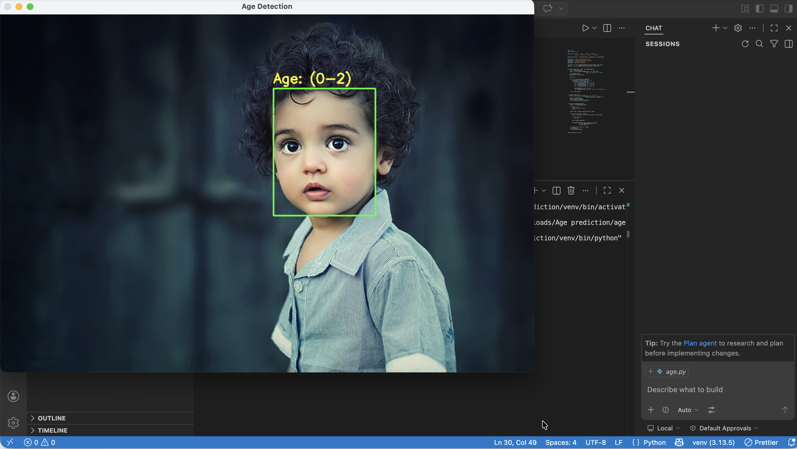
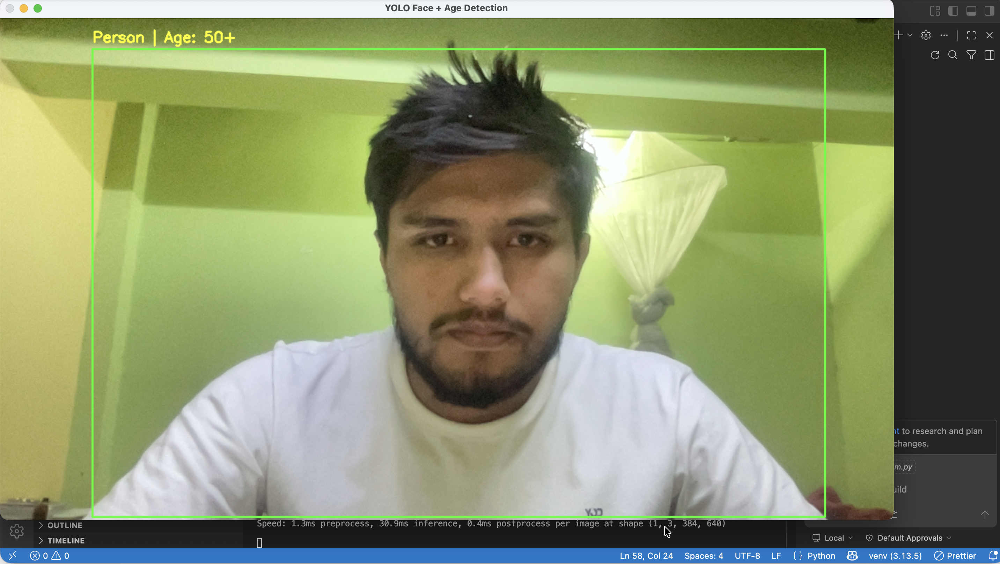

# 🧠 Age Prediction using OpenCV & Deep Learning

A real-time age prediction system built using OpenCV and pre-trained deep learning models. The system detects faces and predicts age groups from images or live webcam feed.

---

# 📸 Demo

## 🖼️ Image Prediction


## 🎥 Live Webcam Prediction


---

# ⚙️ Features

- Real-time face detection
- Age prediction using deep learning model
- Works on images and webcam
- Lightweight OpenCV-based pipeline
- Easy to extend for gender & emotion detection

---

# 🛠️ Tech Stack

- Python  
- OpenCV  
- Deep Learning (Caffe model)  
- NumPy  

---

# 📂 Project Structure

```text id="rm2"
AgePrediction/
│
├── age.py
├── opencv_face_detector.pbtxt
├── opencv_face_detector_uint8.pb
├── age_deploy.prototxt
├── age_net.caffemodel
├── kidagepredict.png
├── livepredict.png
├── README.md
